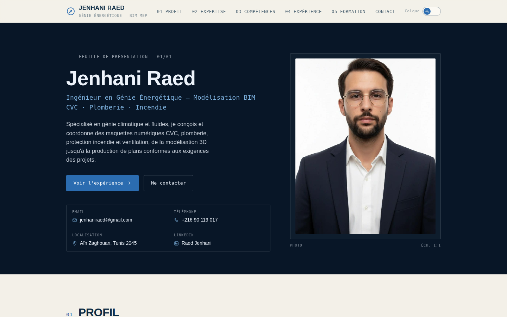
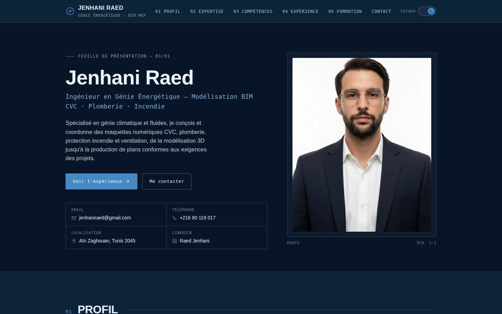
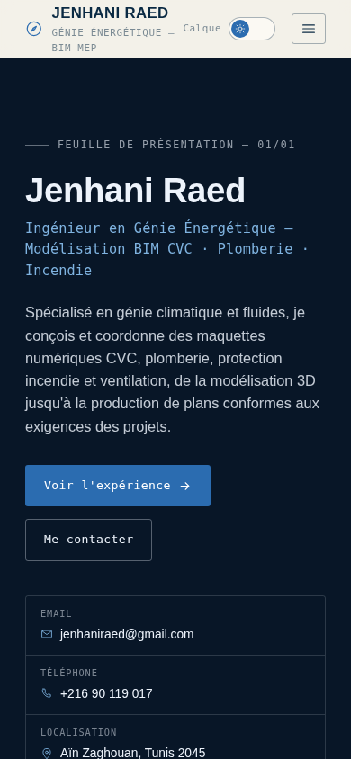
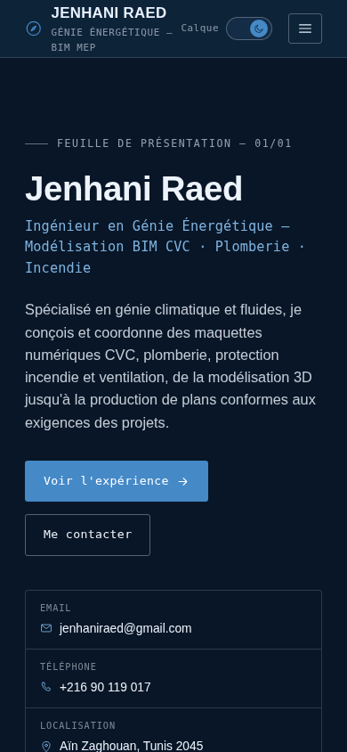
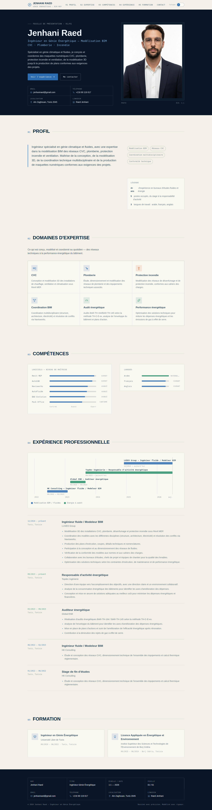
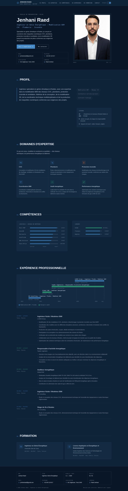

# Jenhani Raed — Portfolio

Site portfolio one-page pour **Jenhani Raed**, ingénieur en génie énergétique
spécialisé en modélisation BIM des réseaux CVC, plomberie, protection incendie
et ventilation.

Le site est construit en HTML/CSS/JS pur (sans framework ni étape de build) et
reprend l'esthétique d'un dossier de plans techniques : grille de calque,
lignes de cotation, numérotation de planches et cartouche, avec deux calques
de lecture — clair et sombre — commutables via l'interrupteur en haut à
droite.

## Aperçu

| Calque clair | Calque sombre |
|---|---|
|  |  |
|  |  |

<details>
<summary>Page complète (clair / sombre)</summary>




</details>

## Structure

```
index.html     Contenu et structure de la page (une seule page, sections ancrées)
styles.css     Système de design (variables de thème clair/sombre, mise en page, responsive)
script.js      Bascule de thème, navigation mobile, scroll-spy, animations au défilement
assets/        Photo, favicon, captures d'écran (screenshots/)
```

## Aperçu local

Aucune dépendance ni installation nécessaire : c'est un site statique.

```bash
python3 -m http.server 8000
# puis ouvrir http://localhost:8000
```

## Déploiement (GitHub Pages)

Pour publier le site avec GitHub Pages :

1. Sur GitHub : **Settings → Pages**
2. Source : **Deploy from a branch**
3. Branche : celle contenant ce code, dossier `/ (root)`
4. Enregistrer — le site sera publié à l'URL fournie par GitHub après
   quelques minutes.
